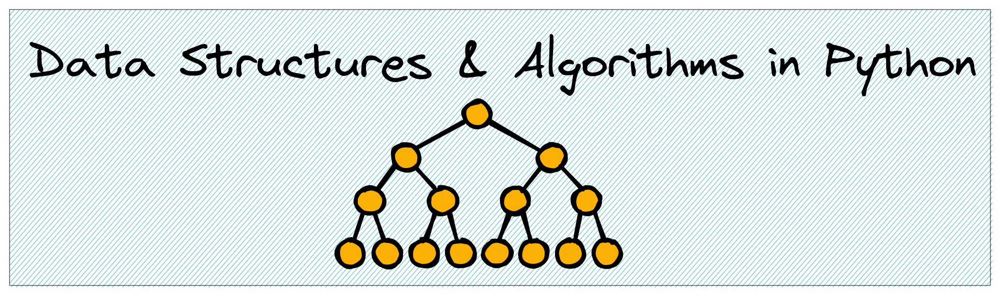

<h1 align="center">
   
  
   
  Data Structures & Algorithms
   
</h1>

### To-do

#### Graphs
- [ ] Connected components
    - [ ] Using Disjoint Set Union
- [ ] Find all topological sorts of a DAG
